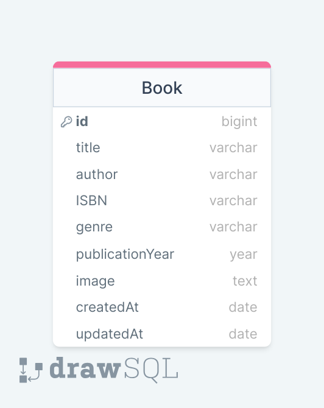

# Book Management System

This project constitutes the backend part of a book management system. It provides RESTful APIs using Express.js and performs basic operations on books over an MongoDB database.

### ERD



## Table of Contents

- [Technologies Used](#technologies-used)
- [Documentation](#documentation)
- [Usage](#usage)
- [Project Skeleton](#project-skeleton)

## Live Demo

[Library API](https://library-be-tw3h.onrender.com/)

## Technologies Used

- **Express.js**: A minimalist web framework for Node.js used for building the RESTful API endpoints.
- **dotenv**: A module used for loading environment variables from a `.env` file into `process.env`.
- **express-async-errors**: A module used for handling asynchronous errors in Express.js middleware and route handlers.
- **MongoDB**: A NoSQL database program, using JSON-like documents with optional schema.
- **Mongoose**: A MongoDB object modeling tool designed to work in an asynchronous environment. It provides a straight-forward, schema-based solution to model your application data.

### Documentation

- Swagger UI: [https://library-be-tw3h.onrender.com/documents/swagger](https://library-be-tw3h.onrender.com/documents/swagger)
- Redoc: [https://library-be-tw3h.onrender.com/documents/redoc](https://library-be-tw3h.onrender.com/documents/redoc)
- JSON Documentation: [https://library-be-tw3h.onrender.com/documents/json](https://library-be-tw3h.onrender.com/documents/json)

## Usage

You can perform basic operations on books such as listing, adding new books, updating, and deleting using this API. Operations can be performed as follows:

- **Listing**: List all books using the `GET /` endpoint.
- **Creating**: Add a new book using the `POST /` endpoint.
- **Reading**: View a specific book using the GET `/:id` endpoint.
- **Updating**: Update a book using either the `PUT /:id` or `PATCH /:id` endpoints.
- **Deleting**: Delete a book using the `DELETE /:id` endpoint. 

## Project Skeleton

```
Book Management System API (folder) 
│
├── src
│    ├── configs
│    │     └── dbConnection.js
│    ├── controllers                
│    │     └── book.controller.js 
│    ├── middlewares   
│    │     └── errorHandler.js 
│    ├── models                
│    │     └── book.model.js
│    └── routes                
│          └── book.router.js
├── .env
├── .gitignore
├── index.js
├── package.json
└── README.md
```
